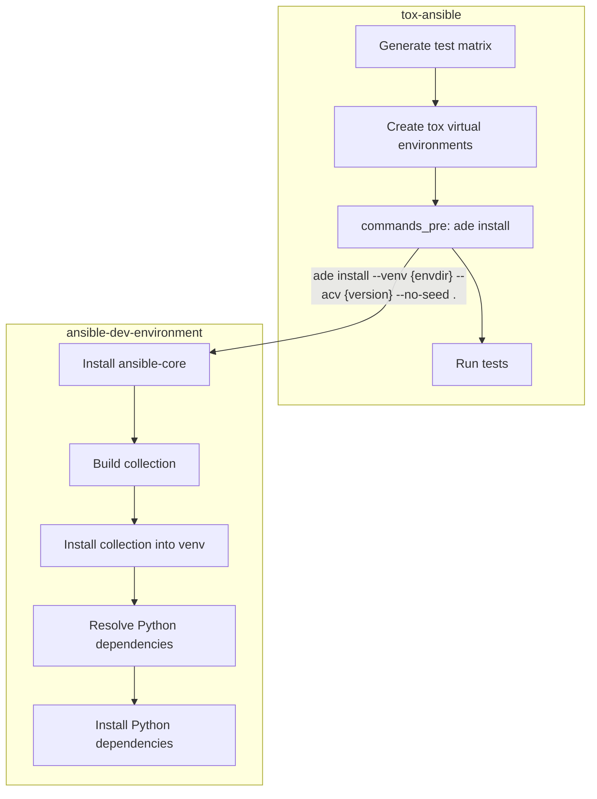

# Architecture

`tox-ansible` delegates collection installation and dependency management to [`ansible-dev-environment`](https://github.com/ansible/ansible-dev-environment) (ade). This keeps `tox-ansible` focused on test matrix generation and CI integration while ade handles the mechanics of setting up each test environment.

## How it works



When `tox-ansible` sets up a test environment (e.g. `unit-py3.13-2.19`), it runs the following sequence:

1. **tox** creates the virtual environment and installs dependencies (including ade itself).
2. **tox-ansible** calls `ade install` in `commands_pre` to install the collection and ansible-core.
3. **ade** installs the requested ansible-core version, builds and installs the collection from the current directory, discovers Python dependencies via `ansible-builder introspect`, and installs them.
4. **tox-ansible** runs the test command (`pytest` or `ansible-test sanity`).

## Roles and responsibilities

### tox-ansible

`tox-ansible` owns the **test orchestration layer** -- deciding what to test, where to test it, and how to run the tests:

- **Test matrix**: Generates the Python version x Ansible version matrix (`py3.13-2.19`, `py3.12-devel`, etc.)
- **GitHub Actions integration**: Produces JSON matrix output for CI workflows via `--gh-matrix`
- **Environment configuration**: Sets up each tox env with the right dependencies, environment variables, and commands
- **Test commands**: Configures `pytest` for unit/integration tests, `ansible-test sanity` for sanity tests, and `galaxy-importer` for galaxy tests
- **Skip/filter**: Allows users to skip specific Ansible versions via the `[ansible] skip` configuration
- **Pre-test setup**: Delegates to ade with a single `ade install` call

### ansible-dev-environment (ade)

`ade` owns the **installation layer** -- the mechanics of getting ansible-core, the collection, and all dependencies into the virtual environment:

- **ansible-core installation**: Handles version numbers (`2.19.0`), branch names (`devel`, `milestone`, `stable-2.19`), and direct URLs
- **Collection build and install**: Copies source, runs `ansible-galaxy collection build`, and installs the resulting tarball
- **Python dependency resolution**: Uses `ansible-builder introspect` to discover Python dependencies declared by collections and their transitive dependencies
- **Python dependency installation**: Installs all discovered dependencies into the venv

### Benefits of this separation

- **Full Python dependency resolution**: ade uses `ansible-builder introspect` to discover and install Python dependencies that collections declare, including transitive dependencies. This was not previously available in `tox-ansible`.
- **Single source of truth**: Collection installation logic lives in one place (ade), avoiding duplication between development and testing workflows.
- **Simpler internals**: `tox-ansible`'s pre-test setup is a single `ade install` command instead of multiple shell scripts for copying, building, and installing.

## The ade command

For each non-galaxy test environment, `tox-ansible` generates a command like:

```bash
ade install --venv /path/to/.tox/unit-py3.13-2.19 --acv stable-2.19 --no-seed --im none .
```

- `--venv`: Points to the tox-managed virtual environment
- `--acv`: The ansible-core version (branch name or version number)
- `--no-seed`: Skips installing `ansible-dev-tools` (tox-ansible provides its own test tooling)
- `--im none`: Disables isolation mode to avoid ansible.cfg conflicts with parallel tox runs
- `.`: Installs the collection from the current directory

For `devel` and `milestone`, the version is passed directly (e.g. `--acv devel`). For numeric versions like `2.19`, it is passed as `--acv stable-2.19` which ade resolves to the corresponding GitHub branch archive.
